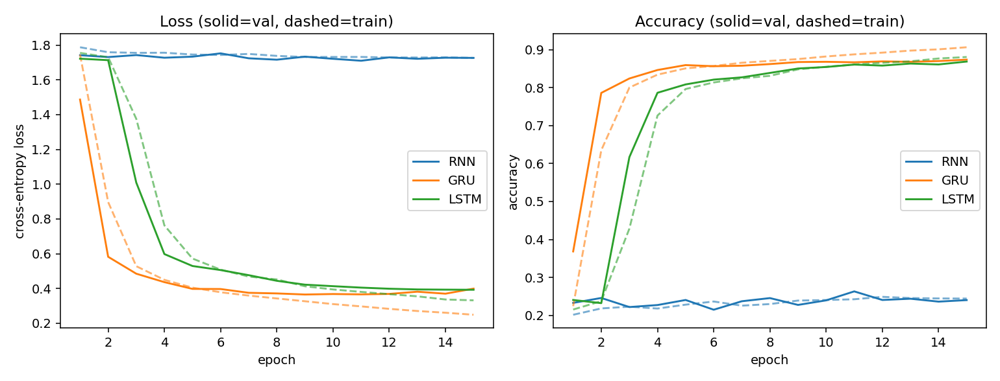
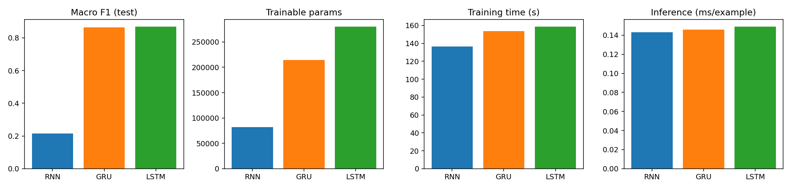
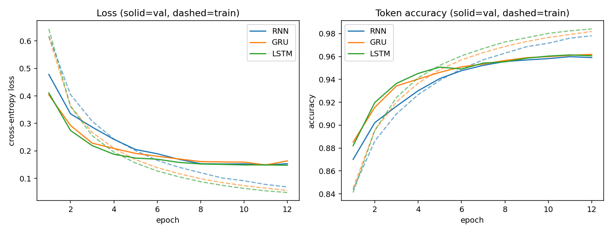
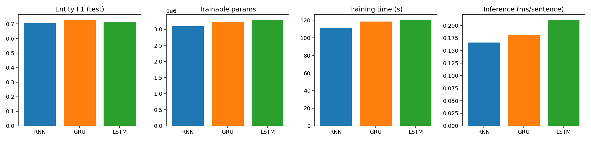
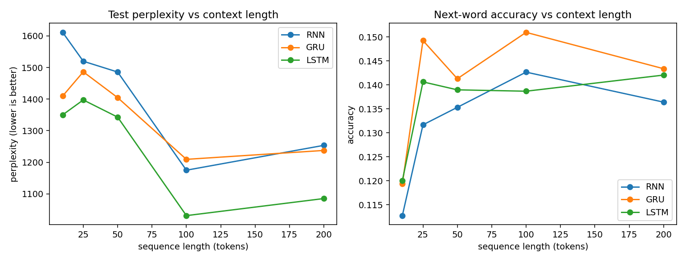
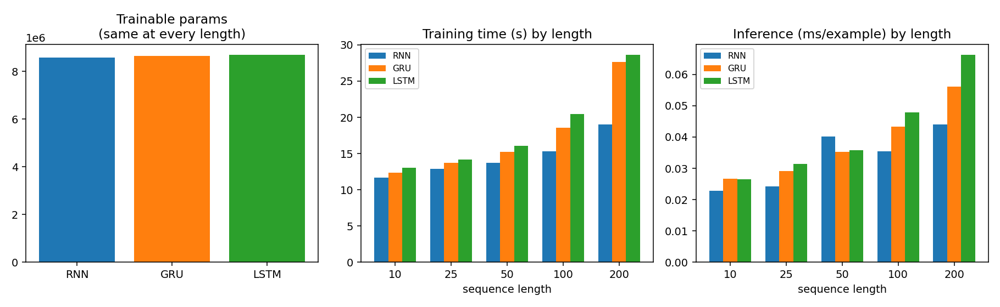
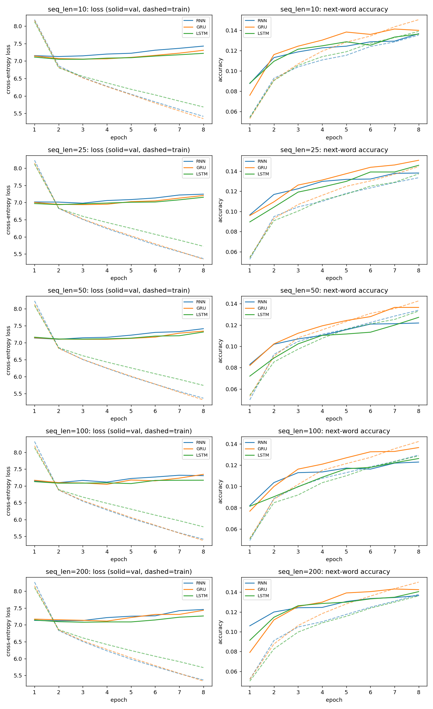
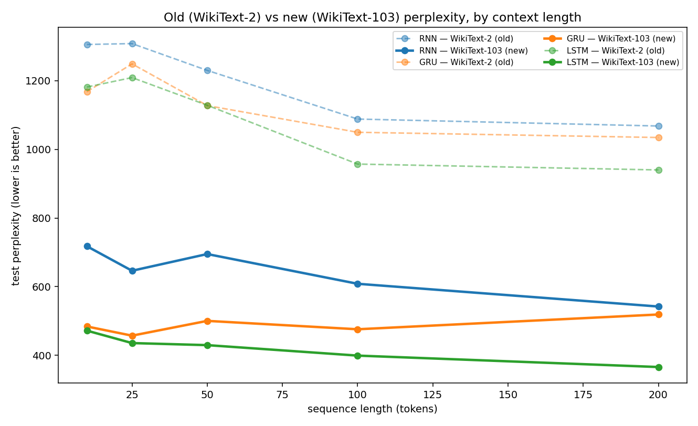
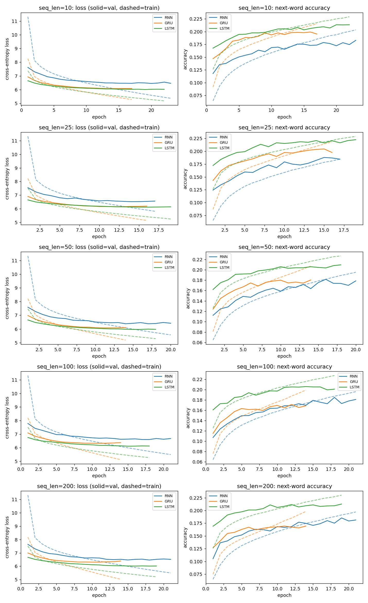
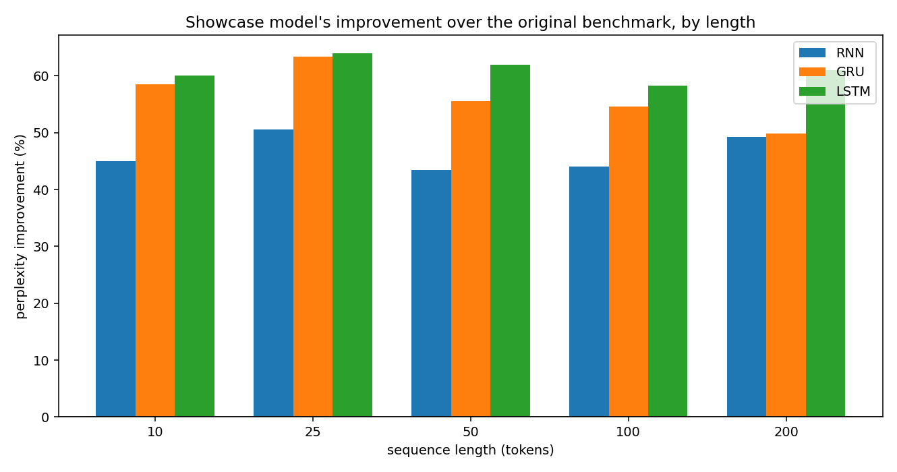

# Recurrent Architectures Benchmark

RNN, GRU, and LSTM, compared fairly on three different real tasks, to test one claim: whether an architecture wins depends on whether the task actually needs long-range memory, not on a fixed ranking between the three. Same embedding size, hidden size, dropout, optimizer, learning rate, batch size, and epoch count within each task; only the recurrent cell changes between runs.

## The finding

| Task | Dataset | Does it need long-range memory? | Result |
|---|---|---|---|
| [Arabic error-type classification](arabic-error-classification/) | Real QALB text | Forced on purpose, character-level windows where the deciding character can sit anywhere | RNN collapses to 22% accuracy (barely above chance), GRU and LSTM both clear 86% |
| [Named entity recognition](named-entity-recognition/) | CoNLL-2003 | No, real sentences average ~14 words | All three land within 2 points of each other |
| [Next-word prediction](next-word-prediction/) | WikiText-2, swept across 5 context lengths | Partly, tested directly, but English next-word prediction leans on recent context anyway | LSTM leads at every length, RNN never collapses |

Same architecture, three very different outcomes. The mechanism is the same throughout: a plain RNN backpropagates through the same weight matrix at every step, so a signal from far enough back vanishes before it can be learned from. GRU and LSTM add gates that give the gradient a more direct path. That only matters once a task actually forces the model to depend on something distant, which is exactly what changes between these three tasks.

## What's in each folder

Each is self-contained: run the scripts from inside that folder, not from the repo root. Full write-up for each, including error examples, is in that folder's `results/report.md`.

---

### 1. [`arabic-error-classification/`](arabic-error-classification/)

Classify a short window of Arabic text by which grammar-error type it contains (punctuation, hamza_alef, split, other, char_ins_del, ta_marbuta), using real sentence pairs from QALB and labels generated by a diff-and-classify pipeline (`qalb_diff.py`), not hand labeling. Needs your own copy of the QALB release (free registration, non-redistributable license, see "Running it" below).

| Model | Test Acc | Macro F1 | Params | Train time | Inference |
|---|---|---|---|---|---|
| RNN | 0.2217 | 0.2156 | 81,926 | 136.6s | 0.1433 ms/ex |
| GRU | 0.8690 | 0.8638 | 214,022 | 153.7s | 0.1460 ms/ex |
| **LSTM** | **0.8707** | **0.8680** | 280,070 | 158.6s | 0.1490 ms/ex |

<table>
<tr>
<td width="50%"></td>
<td width="50%"></td>
</tr>
</table>

---

### 2. [`named-entity-recognition/`](named-entity-recognition/)

Tag every word in a sentence as PERSON / ORGANIZATION / LOCATION / MISC / not-an-entity, on CoNLL-2003, the standard English NER benchmark. Data loads automatically from Hugging Face, no account needed.

| Model | Token Acc | Entity F1 | Params | Train time | Inference |
|---|---|---|---|---|---|
| RNN | 0.9388 | 0.7092 | 3,092,361 | 111.0s | 0.1660 ms/sentence |
| **GRU** | **0.9431** | **0.7274** | 3,224,457 | 118.4s | 0.1819 ms/sentence |
| LSTM | 0.9388 | 0.7147 | 3,290,505 | 120.3s | 0.2110 ms/sentence |

<table>
<tr>
<td width="50%"></td>
<td width="50%"></td>
</tr>
</table>

---

### 3. [`next-word-prediction/`](next-word-prediction/)

Predict the next word from a fixed window of previous words, on WikiText-2, swept across five window sizes (10, 25, 50, 100, 200 tokens) to test the memory-length effect directly instead of just describing it. Data loads automatically from Hugging Face, no account needed. LSTM (bold) wins at every length.

| Seq len | RNN ppl | GRU ppl | LSTM ppl |
|---|---|---|---|
| 10 | 1611.1 | 1409.7 | **1350.1** |
| 25 | 1519.7 | 1486.2 | **1397.3** |
| 50 | 1485.6 | 1404.6 | **1342.8** |
| 100 | 1175.0 | 1209.3 | **1031.2** |
| 200 | 1253.6 | 1237.5 | **1085.3** |

*(perplexity, lower is better; 8,585,727 / 8,651,775 / 8,684,799 params for RNN / GRU / LSTM, identical at every length)*



<table>
<tr>
<td width="50%"></td>
</tr>
</table>

**Full training curves, all 5 sequence lengths:**



#### WikiText-103 showcase: retraining the same 15 runs on a bigger dataset

The sweep above is deliberately capped: every length trains on the same
~20,000 windows and 8 epochs, on purpose, so that "does sequence length
matter" isn't confounded by "does one length just get more data." That's
the right call for answering the research question, but it also caps how
fluent the models can get, which matters for the [live demo app](#live-demo),
where each model's raw output is read directly. A second, separate set of
checkpoints exists for all 3 architectures across all 5 lengths, trained
for that purpose instead, without touching the original benchmark numbers
above:

| | Original benchmark | WikiText-103 showcase |
|---|---|---|
| Dataset | WikiText-2, ~2.05M train tokens | WikiText-103, ~101.4M train tokens (~50x) |
| Vocabulary | 33,279 words | 82,820 words |
| Embedding / hidden size | 128 / 128 | 256 / 256, tied (embedding and output-projection share one matrix, standard in GPT-2 and most modern LMs, which roughly halves the parameter cost of going bigger) |
| Training windows / epoch | ~20,000 (fixed on purpose, for the length comparison) | 600,000 |
| Epoch count | fixed at 8 | up to 25, early-stopped on validation loss (each run stopped between epochs 14 and 23, never hit the cap) |
| Gradient clipping | none | max norm 1.0 |
| Params (rnn / gru / lstm) | 8.59M / 8.65M / 8.68M | 21.4M / 21.7M / 21.8M |
| Generation decoding | none | top-k sampling with repetition penalty and no-repeat-3-gram blocking, preventing loops on repeated phrases |

Same fairness rule as everywhere else in this repo: within the showcase
set, every run shares identical hyperparameters except `--arch` and
`--seq-len`. Trained partly locally, partly on Colab, using
[`prep_data.py --config wikitext-103-v1`](next-word-prediction/prep_data.py)
and the new `--tie-weights` / `--clip-grad` / `--early-stop-patience` /
`--out-suffix` flags on [`train.py`](next-word-prediction/train.py).

**Result: perplexity drops 43–64% at every single length, and LSTM still
wins at every length, exactly like the original finding.**

| Seq len | RNN: old → new | GRU: old → new | LSTM: old → new |
|---|---|---|---|
| 10 | 1305.2 → **717.8** (+45%) | 1167.7 → **484.2** (+59%) | 1181.3 → **472.1** (+60%) |
| 25 | 1307.7 → **646.4** (+51%) | 1248.7 → **457.5** (+63%) | 1208.8 → **435.9** (+64%) |
| 50 | 1229.7 → **695.1** (+43%) | 1127.3 → **500.5** (+56%) | 1128.3 → **429.9** (+62%) |
| 100 | 1088.0 → **608.5** (+44%) | 1049.5 → **476.1** (+55%) | 957.0 → **399.4** (+58%) |
| 200 | 1067.8 → **542.3** (+49%) | 1034.4 → **519.1** (+50%) | 939.9 → **366.2** (+61%) |

*(test perplexity, lower is better; % is the reduction from old to new)*



RNN and GRU visibly converge toward each other as context grows past 100
tokens (519.1 vs 542.3 at length 200, the closest they get anywhere in the
sweep), while LSTM keeps pulling further ahead: its separate cell state
keeps paying off with more context in a way GRU's simpler gating doesn't
match. That's a more specific version of the same story the original
sweep told: LSTM leads throughout, RNN never collapses, because next-word
prediction leans on recent context more than it forces long-range memory.

**Training and validation curves, all 5 lengths (showcase runs):**



GRU and LSTM's training loss (dashed) drops well below their validation
loss (solid) in later epochs at every length: the overfitting gap that
early stopping is watching for, and why those two runs stop between
epochs 11 and 19 rather than running the full 25. RNN's train/val gap
stays much tighter throughout, consistent with a smaller-capacity model
that has less room to overfit in the first place.



Generated continuation, same prompt, old model vs new model (temperature
0.7, top-k 6):

> **Prompt:** *"During World War II , the country was forced to"*
> **Old (WikiText-2):** *the first . The of the first of the first , and the United ,*
> **New (WikiText-103):** *the east , but the ship was not used by the United States . =*

The old model loops on high-frequency phrases and never forms a real
clause. The new one produces actual subject/verb structure: still a
small, 22M-parameter model rather than a fluent writer, but a clearly
different regime, not just a better score.

This comparison can be rebuilt with
[`compare_wt103.py`](next-word-prediction/compare_wt103.py) once both
sweeps exist in `results/`.

<a name="live-demo"></a>
### Live demo

`app.py` at the repo root is a Streamlit app that loads the trained
checkpoints from all three tasks and runs RNN, GRU, and LSTM side by
side on live input: a typed sentence or a sample button produces all
three models' predictions at once, for direct comparison. Next-word
prediction defaults to the WikiText-103 showcase checkpoints described
above; the other two tasks use their benchmark checkpoints directly.

```
pip install -r requirements.txt
streamlit run app.py
```

---

## Method

Every task uses one model class per folder, parametrized by a `cell` argument (`rnn` / `gru` / `lstm`), instead of three separate hand-written model classes that could quietly drift apart from each other. Data prep, vocabulary building, and evaluation code are shared identically across all three runs within a task; only that one argument changes.

Two of the three tasks (error classification, NER) use a bidirectional recurrent layer, since the model gets to see the whole input before deciding anything. Next-word prediction runs one direction only, since predicting a word from a future word would be seeing the answer.

## Running it

```
cd <folder-name>
python prep_data.py     # builds the training data
python train.py --arch rnn      # also --arch gru, --arch lstm
python compare.py       # builds the comparison report and charts once all three have run
```

`named-entity-recognition` and `next-word-prediction` fetch their data from Hugging Face on first run, no account needed. `arabic-error-classification` needs a local copy of the QALB shared-task release under `arabic-error-classification/data/raw/qalb/`. Register at CAMeL Lab's QALB page; the license doesn't allow redistributing the data itself, which is why it isn't bundled here.

To reproduce the WikiText-103 showcase sweep (`next-word-prediction/`
only), fetch the bigger corpus into its own subfolder first, so it never
overwrites the original benchmark's data, then pass the same extra flags
to every run:

```
cd next-word-prediction
python prep_data.py --config wikitext-103-v1 --out-dir data/wikitext103
NWP_DATA_DIR=data/wikitext103 python train.py --arch rnn --seq-len 50 \
    --emb-dim 256 --hidden-dim 256 --tie-weights --min-freq 25 \
    --target-train 600000 --epochs 25 --early-stop-patience 3 \
    --clip-grad 1.0 --out-suffix _wt103      # repeat per --arch / --seq-len
python compare_wt103.py     # builds the old-vs-new comparison once both sweeps exist
```
